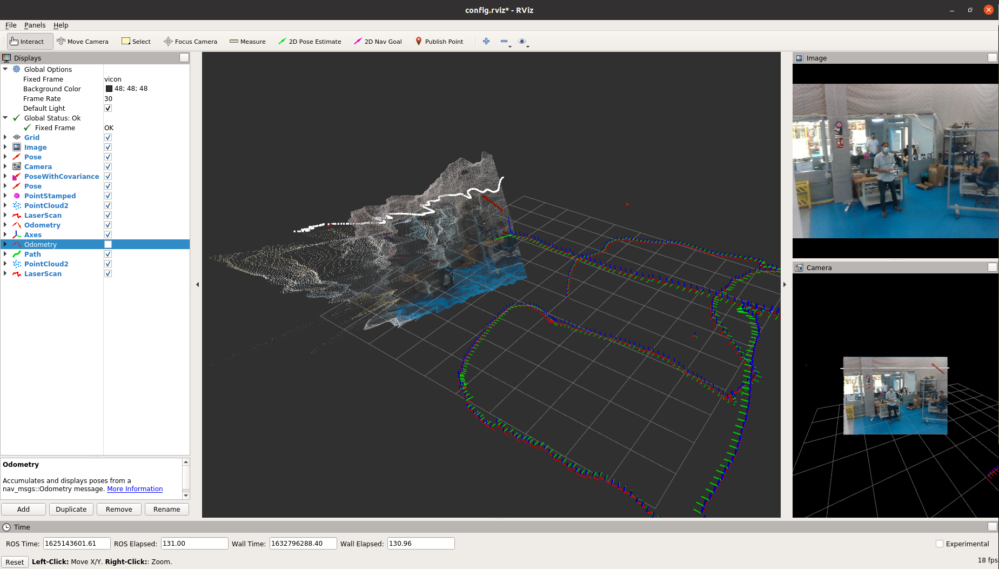

## Metrics 2021 Competition

https://metricsproject.eu/inspection-maintenance/rami-cascade-campaign1-aerial-robots/

General guildelines for the use of this repository, you can figure the missing bits.

> cd docker

> ./build.sh

That will build the development repo and the ones for the submissions.

### Development image

To run the development image, do:

> cd docker

> ./builh.sh

> ./run.sh

This image loads the workspace from the host, allowing to edit files while working.

The image also contains the datasets for both FBM1 and FBM2, just like the original competition docker file.

#### FBM1

The folder `FBM1/the_italian_job` contains a ROS repository used to process the bag datasets.

To process a bagfile, doÑ

> cd FBM1/the_italian_job

> catkin_make

> source devel/setup.bash

> roslaunch tij_challenger process_dataset.launch bag_file:=/home/metrics/FBM1/dataset/FBM1_flight3.bag output_file:=output.txt ground_truth_file:=ground_trugh_file.txt

#### FBM2

The folder `FBM2/the_italian_job` contains a ROS repository used to process the images.

In this case, the code is a script adapting the `Darknet` interface to the required competition interface.

To train the network using the provided dataset:

> cd FBM1/the_italian_job

> cd yolo

> ./train.sh

### Competition image

The competition images can be run with

> cd docker

> ./competition.sh <submission-id>

where `submission-id` is one of `second-submission`, `third-submission`, `fourth-submission` or `final-submission`.

#### FBM1

To run FBM1 in the competition image:

> cd FBM1

> ./the_italian_job_fbm1_launch.sh dataset/FBM1_flight.bag flight1_results.txt

#### FBM2

To run FBM2 in the competition image:

> cd FBM2
> ./the_italian_job_fbm2_launch.sh dataset/crack_detection_dataset_v2/evaluation detections.txt

